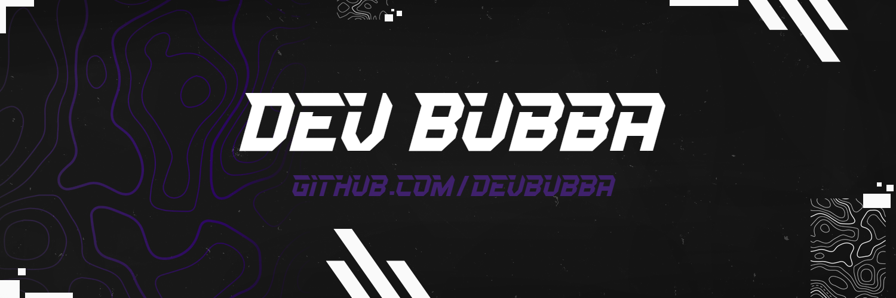

 
 

**About Me**

- 👋 Hi, I’m DevBubba

- 👀 I’m Interested In Open Source Game Hacks And Scripts

- 🌱 I’m Currently Learning C# And C++

- 💞️ I’m Looking To Collaborate On Open Source C# Projects

- 📫 How to reach me ...

 
 

**My Top Repositories**

 
 

**My Stats**

 

